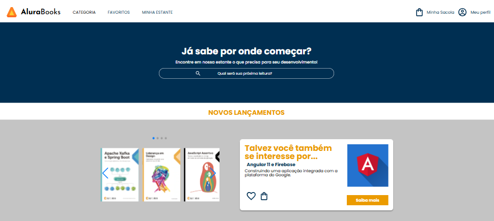

# AluraBooks
Projeto de e-commerce, uma livraria online de livros sobre tecnologia. Desenvolvido durante o curso de Responsividade com mobile-first

## 🚀 Tecnologias

Esse projeto foi desenvolvido com as seguintes tecnologias:

- HTML e CSS
- JavaScript
- Swipper JS
- Git e Github

##  Preview em diferentes tamanhos de tela

  
 
  
  
